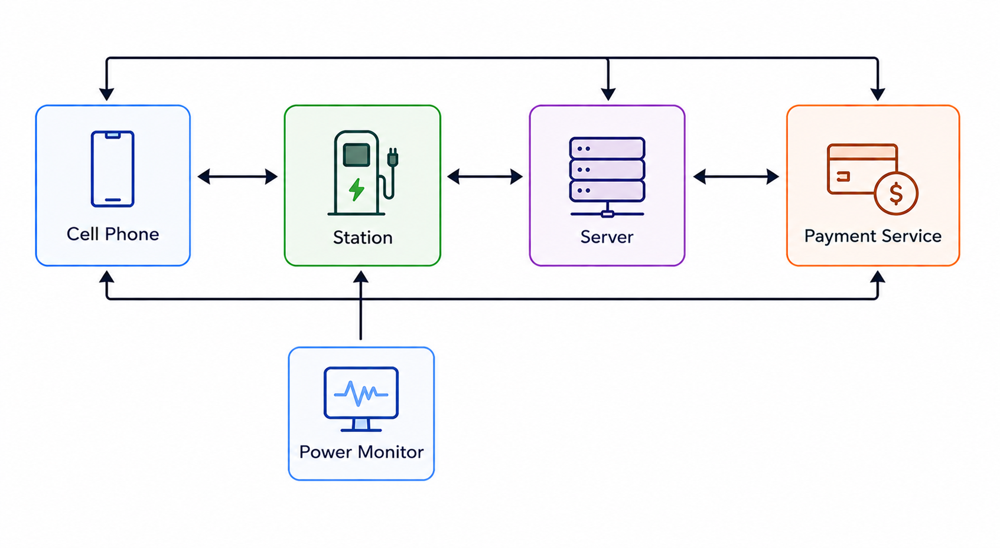

# ChargingStation 

## Epic

This epic focuses on developing an electric vehicle charging station system capable of monitoring and controlling power consumption in real time, accurately tracking energy usage, and billing users based on their consumption during each charging session. The solution will integrate with payment or banking platforms for user billing, include energy metering hardware, and support remote monitoring, reporting, and user management through a backend platform.

The charging station will support Wi-Fi, cellular, or similar communication methods to synchronize data with remote servers; however, it will operate independently without requiring a constant internet connection. This ensures the station can continue providing charging services and processing local operations even when offline.

